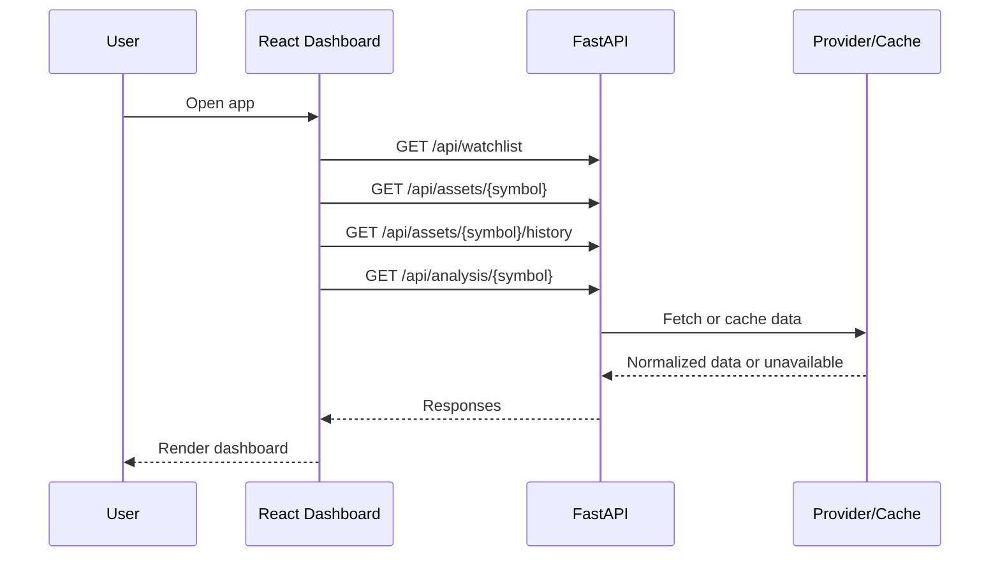
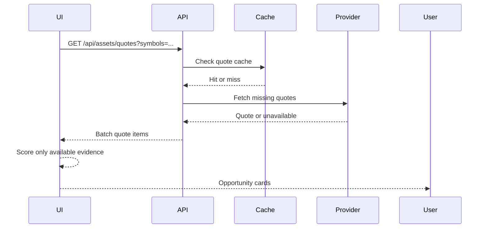
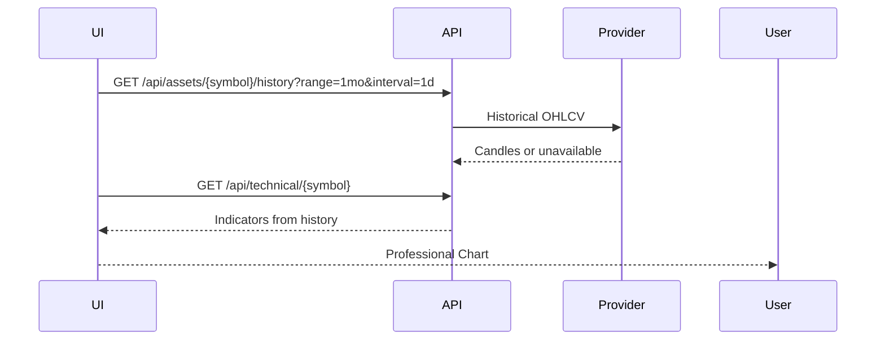
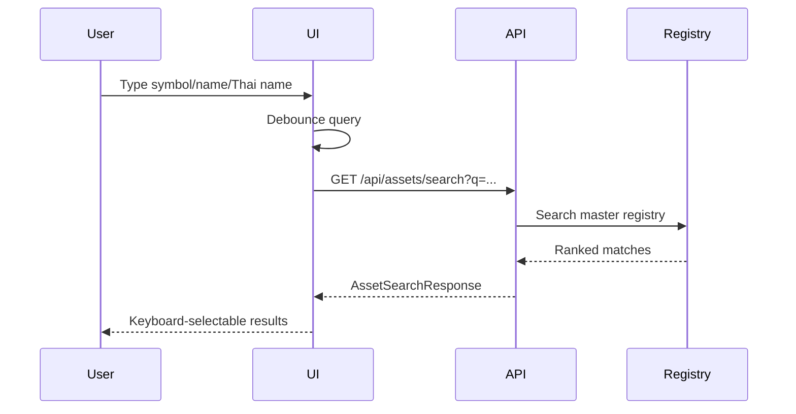
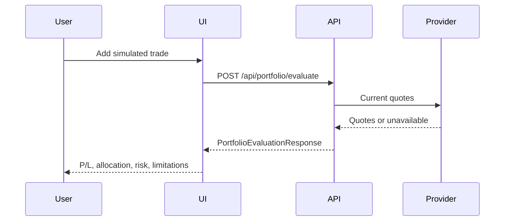
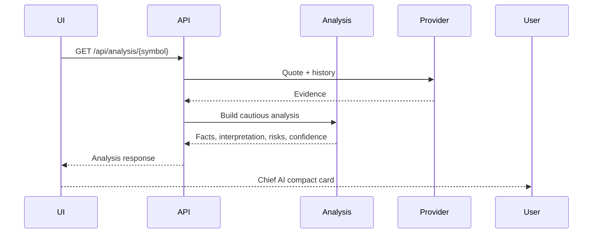
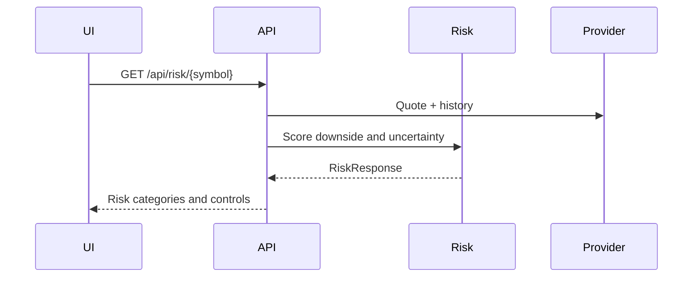
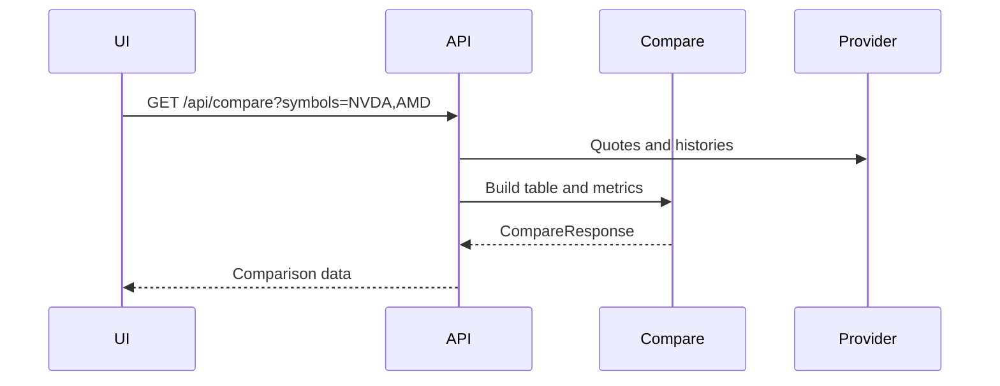
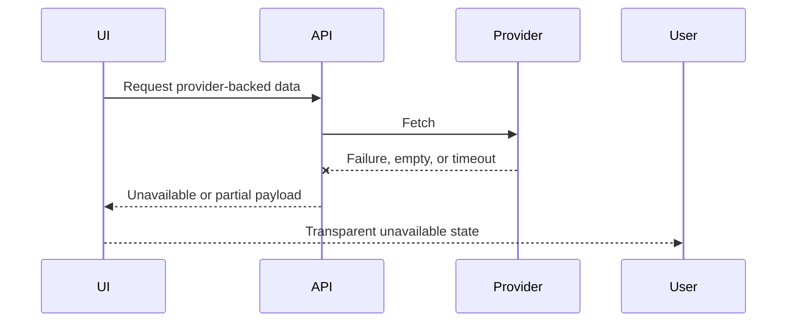
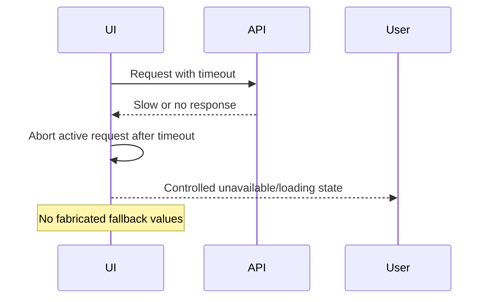

# 12 Sequence Diagrams

## Table of Contents

- [Purpose](#purpose)
- [Dashboard Load](#dashboard-load)
- [Opportunity Scan](#opportunity-scan)
- [Chart Request](#chart-request)
- [Search](#search)
- [Portfolio Analysis](#portfolio-analysis)
- [Chief AI](#chief-ai)
- [Risk Analysis](#risk-analysis)
- [Compare](#compare)
- [Provider Failure](#provider-failure)
- [Timeout Recovery](#timeout-recovery)
- [Current Production](#current-production)
- [Future Roadmap](#future-roadmap)
- [Known Limitations](#known-limitations)
- [Related Documents](#related-documents)

## Purpose

This document captures the main request and failure flows using Markdown diagrams. The diagrams are intentionally text-based so they survive code review and long-term maintenance.

## Dashboard Load

## Opportunity Scan

## Chart Request

## Search

## Portfolio Analysis

## Chief AI

## Risk Analysis

## Compare

## Provider Failure

## Timeout Recovery

## Current Production

These flows reflect current local and production architecture. Batch quote timeout is intentionally longer than ordinary requests.

## Future Roadmap

- add deployment sequence diagrams
- add alert delivery diagrams once sending is enabled
- add cloud sync diagrams after authentication design

## Known Limitations

- Diagrams are conceptual and omit some cache internals.
- Mermaid rendering depends on the Markdown viewer.

## Related Documents

- [02 System Architecture](02_SYSTEM_ARCHITECTURE.md)
- [10 API Reference](10_API_REFERENCE.md)
- [13 State Management](13_STATE_MANAGEMENT.md)

