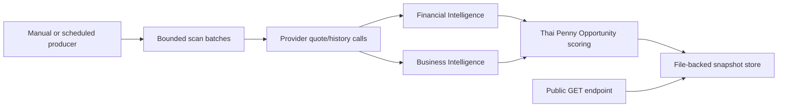

# RC5A.2 Thai Penny Snapshot Producer

## Purpose

RC5A.2 introduces an explicit, bounded snapshot producer for the Thai Penny Opportunity Engine.

The public endpoint remains snapshot-first:

- `GET /api/opportunities/penny` reads the latest published snapshot.
- It does not launch full-universe scans during user requests.
- If no snapshot exists, it returns a transparent `not_ready` state.

This protects the Render production service from request-time memory spikes and provider fan-out while preserving the RC5A methodology.

## Architecture



## Producer Command

Local Windows:

```powershell
cd D:\market-pulse-ai\backend
.\.venv\Scripts\python.exe -m app.jobs.generate_penny_snapshot --market TH --max-price 10 --limit 5
```

Render Shell:

```bash
python -m app.jobs.generate_penny_snapshot --market TH --max-price 10 --limit 5
```

The command prints concise JSON diagnostics including status, item count, scan metadata, qualification counts, bounded batch settings, and memory observations.

## Configuration

| Variable | Default | Purpose |
| --- | ---: | --- |
| `OPPORTUNITY_SNAPSHOT_DIR` | `runtime/opportunity_snapshots` | File-backed snapshot directory. |
| `PENNY_SCAN_MAX_SYMBOLS` | `160` | Maximum registry symbols considered per scan. |
| `PENNY_SCAN_BATCH_SIZE` | `20` | Registry symbols evaluated per bounded batch. |
| `PENNY_SCAN_MAX_PROVIDER_BATCH` | `80` | Maximum provider quote symbols per provider batch. |
| `PENNY_SCAN_MAX_WORKERS` | `6` | Maximum concurrent candidate workers. |
| `PENNY_SCAN_DEADLINE_SECONDS` | `45` | Total scan deadline. |
| `PENNY_SCAN_PROVIDER_TIMEOUT_SECONDS` | `20` | Operational provider timeout budget exposed in diagnostics. |
| `PENNY_SCAN_RETRY_LIMIT` | `0` | Retry budget exposed in diagnostics. |

## Snapshot Status Model

| Status | Meaning |
| --- | --- |
| `ok` | A current successful snapshot exists. |
| `partial` | The producer finished with provider limitations but still published real qualified data. |
| `not_ready` | No successful snapshot has been published yet. |
| `scan_in_progress` | A producer is already running and no new scan should be started. |
| `stale` | A previous successful snapshot is served after a later scan failed or became older than the freshness window. |
| `failed` | A scan failed and no prior successful snapshot exists. |

## Memory Controls

RC5A.2 avoids the previous high-memory path by:

- Processing registry candidates in bounded batches.
- Prefetching provider scan quotes only for the current batch.
- Releasing batch quote/result objects after each batch.
- Keeping public GET requests read-only.
- Persisting snapshots to disk so Render restarts do not erase the latest completed scan.
- Recording start/end/observed memory metrics for operational review.

## Zero Mock Policy

The producer never fabricates:

- Prices
- Charts
- Financial metrics
- Business evidence
- Catalysts
- Opportunity rankings

Unavailable data reduces confidence or produces transparent empty/stale/failed states.

## Founder Acceptance

Founder Acceptance remains **PENDING** until production runs the producer, the public endpoint serves a real snapshot, and production smoke testing confirms stable memory behavior below the Render 512 MB limit.
